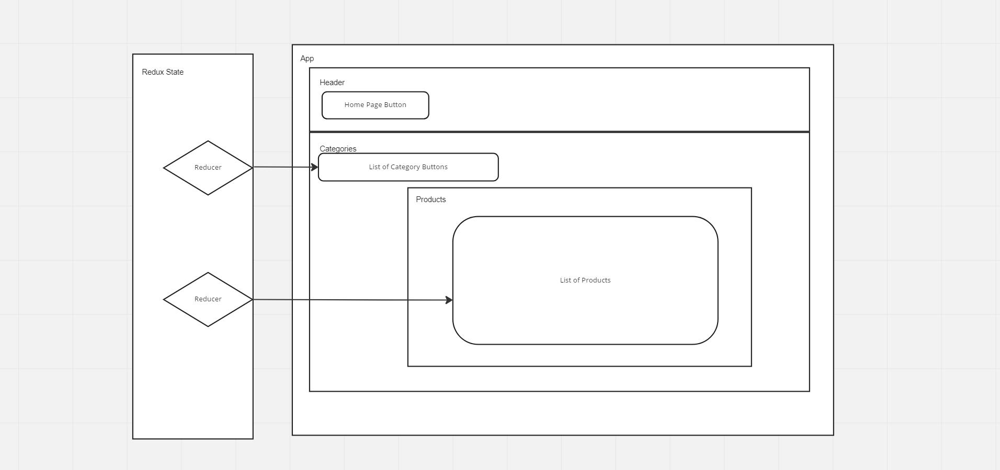
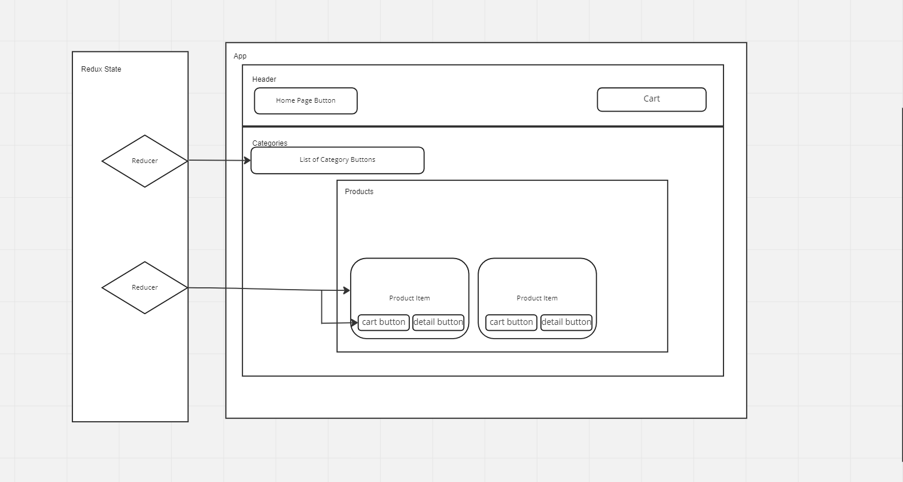
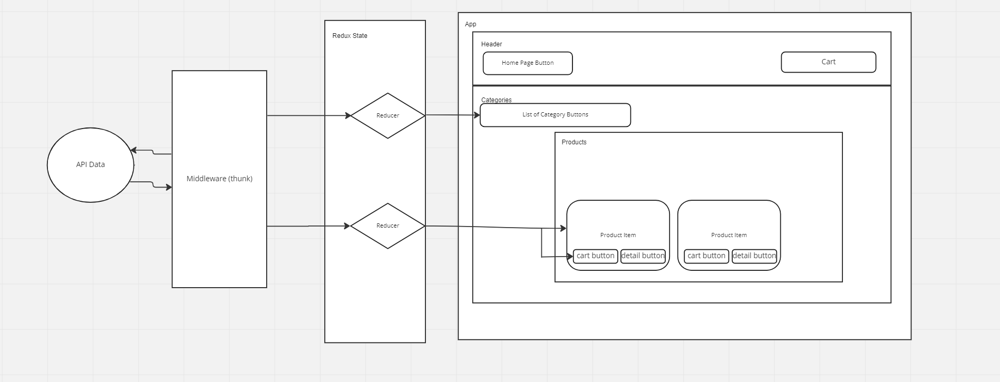

# Storefront App

### Author: Hayden Cleaver

An  E-commerce application that is designed using redux global state and styled with Material UI.

## Phase 1

- Redux state created for categories and products
- Stored categories are rendered as buttons
- Products rendered when category button is clicked
- Basic styling for header, footer, product cards, and buttons completed 

### UML

### Deployment

- Phase 1: [CodeSandbox](https://codesandbox.io/p/github/HaydenCleaver/storefront/draft/gracious-dawn)

## Phase 2

- Added cart component to header
- Added 'add to cart' and 'view details' buttons to product cards
- Cart state implemented and update when 'add to cart' is clicked

### UML

### Deployment

- Phase 2: [CodeSandbox](https://codesandbox.io/p/github/HaydenCleaver/storefront/combined-reducers)

## Phase 3

- Added API database interaction using Thunk
- Inventory quantity is correctly updated based upon user interactions

### UML

### Deployment

- Phase 3: [CodeSandbox]()